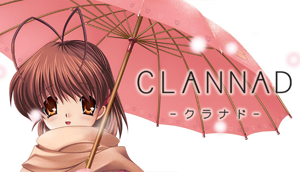

# CLANNAD android Việt Hoá

## Giới thiệu
 
Tôi căm ghét thị trấn này.

Nó đầy rẫy những kí ức mà tôi muốn quên đi.

Một cuộc sống vô vị, không mục tiêu, không lý tưởng...

Kể cả thú vui cho bản thân mình cũng không.

Suốt 365 ngày

Không một giây nào tôi thấy bình yên.

Những tháng ngày vô nghĩa tưởng như không chấm dứt.

( biểu hiện của trầm kảm đấy :penguin: )

Nhưng...

Trên con đường ấy...

Một cô gái nhút nhát...

Với những lời nói ngây thơ đến kì lạ.

Cuộc gặp gỡ đó...

Đã làm thay đổi hoàn toàn cuộc đời tôi.

(Ps: Muốn thoát trầm kảm ư, chơi game này học cách tán gái đi :rofl: )

_____________________________________________________________________________
### Hãy **ĐỌC KĨ** các nội dung dưới đây.

## Thông tin chung
- Đây là phiên bản port từ đĩa cài CLANNAD Full Voice, được mod lại để chơi được trên android thông qua giả lập rlvm
- Bản port được tạo ra với mục đích ban đầu là dành cho bản thân người port, nên các vấn đề về lỗi phát sinh trong và sau khi cài sẽ không được hỗ trợ.
- Bản dịch được lấy từ [đây](https://www.baka-tsuki.org/project/index.php?title=CLANNAD_%7EVietnamese%7E), của nhóm vnkeyfc.
- Nghiêm cấm sử dụng bản port dưới bất kì hình thức thương mại nào.

## Link tải
- Github: [link](https://github.com/luudanmatcuoi-vn/CLANNAD_android_viethoa/raw/main/CLANNAD_android_viethoa_patch.rar)

## Cách cài đặt

Video hướng dẫn : https://youtu.be/kFRp3Is5EFw

- Cài đặt mới game bằng đĩa gốc. Các bạn có thể tìm kiếm tại [đây](https://solidtorrents.to/torrents/key-clannad-full-voice-rar-83345/5bd7e76914ab180a270b7ff9/)
- Download bộ patch và giải nén (password: `Luudanmatcuoi`) vào thư mục chứa game, mặc định là `C:\KEY\CLANNAD_FV`
- Cài đặt app giả lập rlvm: [link](https://m.apkpure.com/vn/rlvm/is.xyz.rlvm)
- Mở app rlvm rồi tắt
- Sao chép toàn bộ thư mục chứa game vào điện thoại android
- Sao chép và ghi đè file `DroidSansFallbackFull.ttf` vào thư mục `Android/data/is.xyz.rlvm/files` trong điện thoại.
- Mở app rlvm, đến thư mục game và chiến thôi.

## Lưu ý

- Thoát game bằng cách bấm "EXIT" hoặc "End the game" để các savegame của bạn lưu lại trong lần chơi tiếp theo

** LÀM ƠN THOÁT GAME BẰNG CÁCH BẤM NÚT EXIT TRONG GAME**

 ( kể cả bạn save trong game rồi nhưng tiện tay tắt app rlvm thì quá trình chơi của bạn không được lưu ( Note: Đó là tính năng ) )

- Đây là phiên bản chơi "được" ko có nghĩa là chơi "tốt" trên android.
  ( đừng bắt 1 con game 20 năm trước với trình giả lập đã ngừng phát triển từ thập kỷ trước phải chạy mượt mà )
- Một số câu thoại sẽ không được việt hoá hoặc viet hoa khong dau ( do dev lười :penguin: )
- Giao diện game sẽ không được việt hoá mà là tiếng anh.
- Save game của rlvm không tương thích với bất cứ phiên bản nào khác.
- Không có chức năng dangopedia các từ dangopedia và giải nghĩa sẽ được cập nhật sau trên trang này.

  
 Mình khuyến khích các bạn chơi bản HD đã được việt hoá bởi vnkeyfc :penguin:

## Bug report
- Hỏi gì sang kênh youtube của mình mà hỏi https://www.youtube.com/channel/UCdyAb9TAX1qQ5R2-c91-x8g ( mặc dù kênh bị tha hoá r )
- Báo lỗi thì viết tâm thư qua tab Issues ý... chắc là t sẽ fix.

## Acknowledgments
Để có được bản port này, xin được gửi lời cảm ơn đến:
- [Haeleth](http://www.haeleth.net/) Một thiên tài, người khởi đầu cho tất cả
- [xyzz](https://github.com/xyzz/rlvm-android) Người viết trình giả lập
- [vnkeyfc](https://vnkeyfc.com) Đơn vị dịch game
- [Baka-Tsuki](https://www.baka-tsuki.org/) Nơi lưu trữ bản dịch game
- [Kazamatsuri](https://kazamatsuri.org/) Cộng đồng hâm mộ Key (đã tốt nghiệp) 
- vnsharing.net tuổi thơ :penguin:

## Thừa giấy vẽ voi
Yeah... cuộc hành trình dài,... dài đằng đẵng,... tưởng chừng vô tận,... cuối cùng... đã đến hồi kết.

Như t đã đề cập trong lời bình của bản việt hoá CLANNAD HD, t bắt đầu từ con số 0, hoàn toàn tự học. T làm gần như hết và toàn bộ là tự học.
Tuổi thơ học tập của t là những ngày tháng bắt trộm wifi hàng xóm, copy từng bài viết trên mạng sang doc để về đọc dần hoặc thức cả buổi trưa tải 2GB file ghost winxp để học cài lại win hoặc tốn cả buổi lục lọi internet chỉ để kiếm file pdf cho cuốn sách mà mình muốn đọc. Cho nên t vẫn luôn cảm kích tới những bài viết hướng dẫn tâm huyết không dấu diếm kiến thức, không quảng cáo gì.
Bản port này là lời cảm ơn nhỏ tới những vị anh hùng nặc danh đó và là tia hi vọng cho những bạn trẻ không có máy tính. Mong càng nhiều người hơn biết tới tác phẩm ý nghĩa này.

Sayonara

